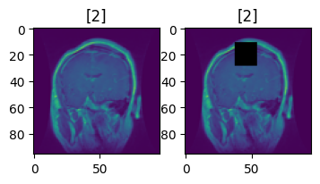

## Self-supervised-Learning-2023
### Goal
This project is focused on identifying brain tumors using a self-supervised method. Instead of training the model in a traditional way, I utilized two different methods known as encoder and contrastive models. These models have distinct ways of learning the underlying features from an image. The primary goal is to develop the pretext functions and the models to pretrain using the available training samples. Following the pretraining phase, additional layers are added to fine-tune the models for the precise classification of brain tumors.

### Dataset
Dataset is available on this webpage: https://figshare.com/articles/dataset/brain_tumor_dataset/1512427/5
There is a less amount of data available from the source. So, the samples were distributed as follows:
Number of training samples: 2451
Number of finetuning samples: 123
Number of testing samples: 490

