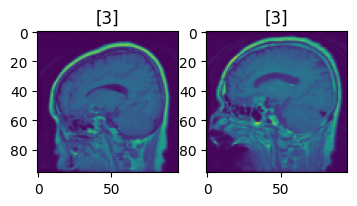
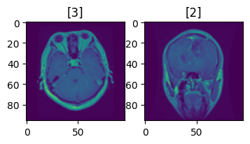
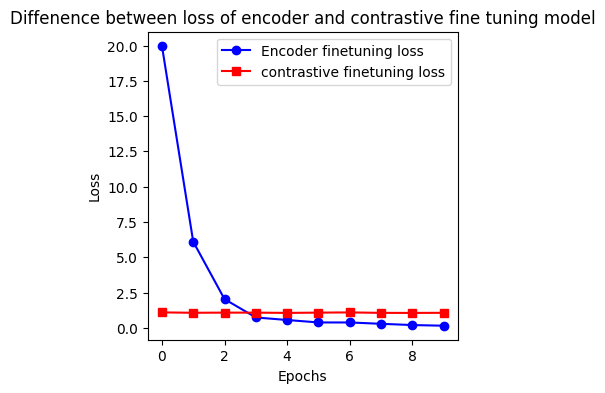
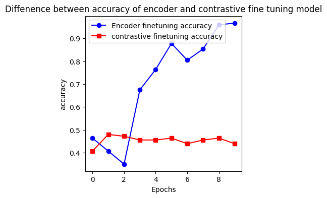
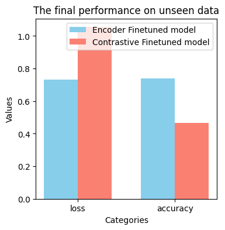

## Self-supervised-Learning-2023
### Goal
This project is focused on identifying brain tumors using a self-supervised method. Instead of training the model in a traditional way, I utilized two different methods known as encoder and contrastive models. These models have distinct ways of learning the underlying features from an image. The primary goal is to develop the pretext functions and the models to pretrain using the available training samples. Following the pretraining phase, additional layers are added to fine-tune the models for the precise classification of brain tumors.

### Dataset
Dataset is available on this webpage: https://figshare.com/articles/dataset/brain_tumor_dataset/1512427/5
.There is a less amount of data available in the source. So, the samples were distributed as follows:  
Number of training samples: 2451  

Number of finetuning samples: 12  

Number of testing samples: 490  

### Encoder model
This model functions similarly to an unsupervised model. The training samples were masked using a random mask size. During training, both the masked image and the original image are passed through the network to help the model learn the missing parts of an image. Here's an example of an image alongside the same image after masking.
  

### Contrastive model
To train the model, 2000 positive and negative pairs were generated. The function responsible for generating these pairs serves as a pretext generation for this model. Although labels were fed into the network, they only indicate the positive and negative pairs and not the original label. Here are examples of positive and negative pairs.  
<table>
  <tr>
    <td align="center">
      
       
      <em>Positive Pair</em>
    </td>
    <td align="center">
      
       
      <em>Negative Pair</em>
    </td>
  </tr>
</table>

### Self-supervised
As the primary objective of this project is to introduce SSL (Self-Supervised Learning). The previously mentioned models function as a means of pretraining images without explicit labeling. In the encoder model, the algorithm identifies image features by reconstructing the missing parts. On the other hand, the contrastive model determines the relationship between pairs, discerning whether they are negative or positive.

### Training Environment
As these are not a large models and pretext generation doesn't massive computational power. So, this work has been done on the following setup:  
Processor: Inter Core i5 (1.4Ghz Quar-core)  
RAM: 8GB
Built in Intel graphics card  
The model was pretrained for 20 epochs using the ADAM optimizer with the default learning rate. Subsequently, fine-tuning for the classification model involved 10 epochs with a learning rate of 0.001 using the ADAM optimizer.

### Result
<table>
  <tr>
    <td align="center">
      
       
      <em>Fine Tuning Loss </em>
    </td>
    <td align="center">
      
       
      <em>Fine Tuning Accuracy</em>
    </td>
  </tr>
</table>

Now the performance of both model
<table>
  <tr>
    <td align="center">
      
       
      <em>Model Performance</em>
    </td>
  </tr>
</table>

